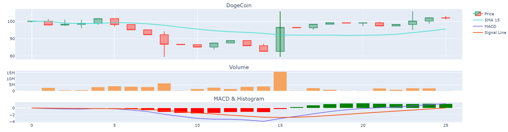

# Market-Simulation-Game
Inspired by various market theories from Macroeconomics, this game will allow a user to unlock and experiment different Technical Analysis tools to try to beat a Random-Walk market.

## Gameplay
The player will be presented with an adapting market:

Example Game State, 25 days in: 

The player may then shoose to either buy a call, short, or no action.
